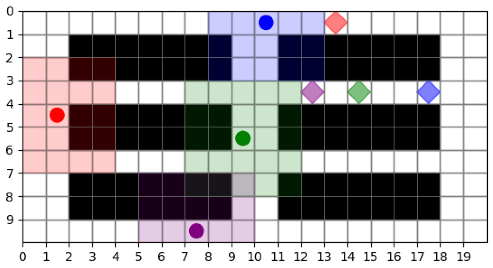
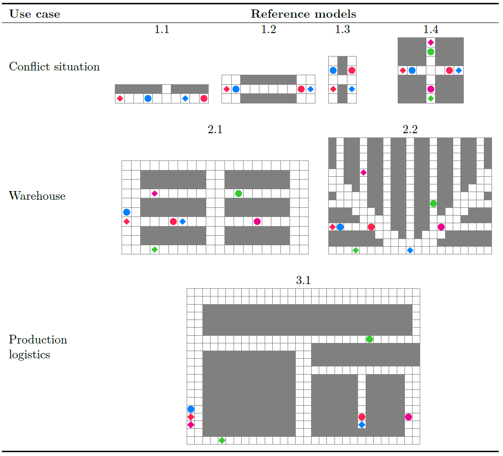

# Deadlock Reference Models for Multi-Agent Pathfinding with RLlib

This repository collects reference implementations for training and evaluating reinforcement learning agents on multi-agent pathfinding problems. The environments explicitly support deadlocks so that agents must cooperate to resolve them. All algorithms are built with RLlib to encourage reproducibility and extensibility.
The code base is part of ongoing doctoral research; version `v1.0.0` corresponds to the snapshot that will be referenced in the author's PhD thesis.

## Features

- **Multi-Agent Environments**: Grid worlds with obstacles, deterministic or random start and goal positions. Implemented in [`src/environments`](src/environments).
- **RLlib Agents**: Configuration helpers for PPO, DQN and IMPALA located in [`src/agents`](src/agents).
- **Custom Models**: Action masking models in [`models`](models) integrate with RLlib.
- **Training Script**: [`main.py`](main.py) can train or test agents depending on the selected mode.
- **Video Logging**: Automatic wandb video recording of training episodes to monitor agent behavior during training.
- **Classical Planners**: Baseline implementations such as A* and CBS in [`scripts`](scripts).
- **Experiment Results**: Logs and heatmaps are stored under [`experiments`](experiments).

## Overview of available Reference Models




## Getting Started

Install the project dependencies (Python 3.11 is recommended) and run the training script:

```bash
python -m pip install -r requirements.txt
python main.py
```

Run tests with:

```bash
pytest
```

## Video Logging

The repository includes automatic video logging functionality to monitor agent behavior during training. Videos are recorded and uploaded to wandb every x iterations.

### Configuration

Enable video logging by modifying the `video_logging` section in the `env_setup` dictionary in `main.py`:

```python
env_setup = {
    # ... other config ...
    "video_logging": {
        "enabled": True,  # Enable video logging to wandb
        "frequency": 50,  # Record videos every 50 iterations
        "max_episodes_per_iteration": 1,  # Record 1 episode per iteration
        "fps": 5,  # Video frames per second
        "max_frames_per_episode": 200,  # Maximum frames to record per episode
    },
}
```

### Configuration Options

- `enabled`: Enable or disable video logging (default: False)
- `frequency`: Record videos every N training iterations (default: 50)
- `max_episodes_per_iteration`: Maximum number of episodes to record per iteration when video logging is active (default: 1)
- `fps`: Frames per second for the generated videos (default: 5)
- `max_frames_per_episode`: Maximum number of frames to record per episode (default: 200)

### How it Works

1. The `WandbVideoCallback` monitors training iterations
2. Every N iterations (based on frequency), it enables video recording
3. The environment captures frames during episode execution using matplotlib
4. Frames are collected and converted to video format
5. Videos are automatically uploaded to wandb for visualization

### Requirements

Video logging requires:
- wandb for video uploads
- matplotlib for rendering
- Pillow for image processing

## Project Structure

```
├── src/               # Environment and trainer code
├── models/            # Custom RLlib models
├── scripts/           # Baseline planning algorithms and utilities
├── experiments/       # Generated results
└── tests/             # Unit tests
```

## Versioning

The `v1.0.0` tag represents the reference version that will accompany the author's PhD thesis. A URL for citation will be added once the thesis is published.

## License

This project is released under the MIT License.
